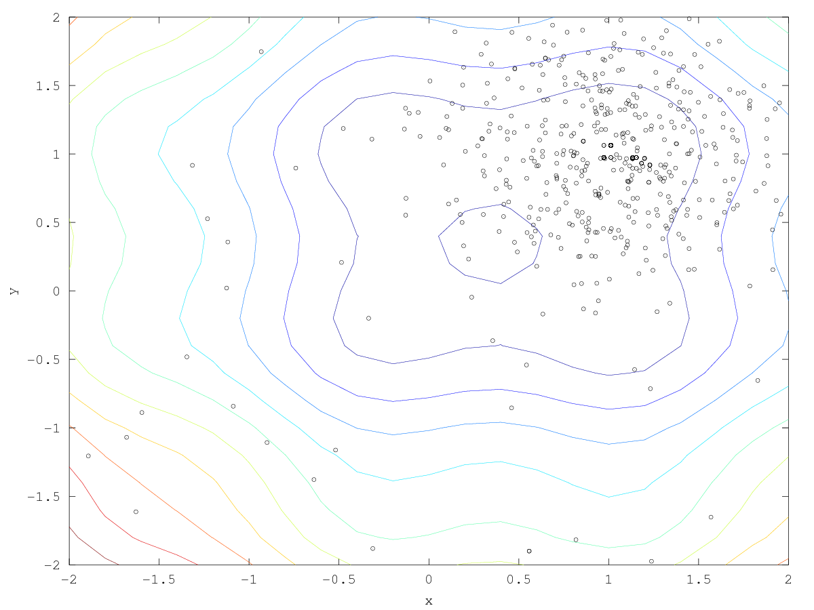

:toc:

= GA0: Genetic Algorithm, Difficulty Zero

== Quick start instructions

----
./setup.sh
swift/run --settings=swift/settings.json
----

== Overview

This runs a real EA with http://deap.readthedocs.io/en/master[DEAP].  The objective function is simply:

_sin(4x) + sin(4y) - 2x + x² - 2y + y²_

It is expressed for the workflow as a Python snippet in workflow.swift

////
It is expressed for the workflow in https://github.com/emews/EQ-Py/blob/master/examples/ga0/Tcl/Tcl-Task/task.tcl[task.tcl]
and for plotting in https://github.com/emews/EQ-Py/blob/master/examples/ga0/plots/f.m[f.m]
////
== File index

=== Entry points

* +setup.sh+: Installs the EQ-Py system into this project directory
* +swift/run+: Runs the workflow

=== Supporting files

* +python/algorithm.py+: EQ-Py interface to DEAP
* +swift/settings.json+: Settings processed by +algorithm.py+
* +swift/workflow.swift+: The Swift script.  Receives parameters from DEAP, executes them on the objective function (+task()+), and returns results to DEAP

== Plots

=== File index

In the +plots/+ directory:

==== Entry points

* +create-xyz.tcl+: Scans the Swift output and creates Octave-compatible data files {x,y,z}.dat .  These are the points sampled by DEAP. Usage:
+
----
cd plots
./create-xyz.tcl
----
+
* +trajectory.m+: Combines the contour plot with data points from {x,y,z}.dat.  Creates +plot.png+. Usage:
+
----
cd plots
octave trajectory.m
----

==== Supporting files

* +f.m+: The implementation of the objective function in Octave, used only for visualization
* +show_f.m+: Make a contour plot from +f.m+

=== Example output images

// align=center only works in HTML output, not on GitHub

. Run with σ = 0.5:
+

+
. Run with σ = 0.1:
+
image::plots/plot-s01.png[width=400,align="center"]

== Machines

=== Beagle

Simply run:
----
./setup.sh
beagle/run-swift.sh
----

=== Midway

Simply run:
----
./setup.sh
swift/run --settings=swift/settings.json
----
